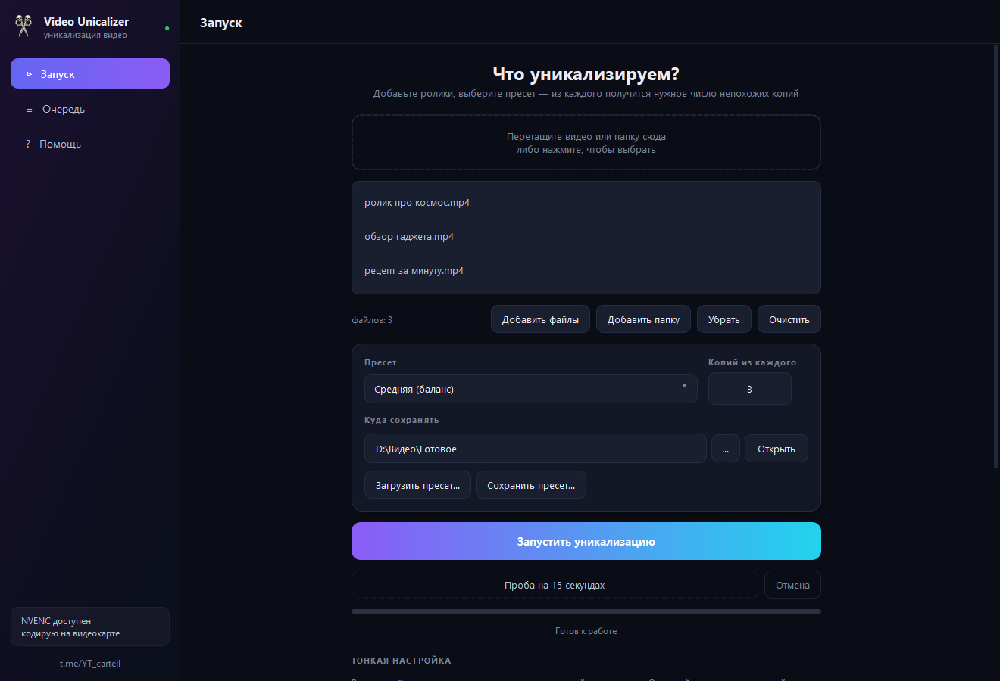
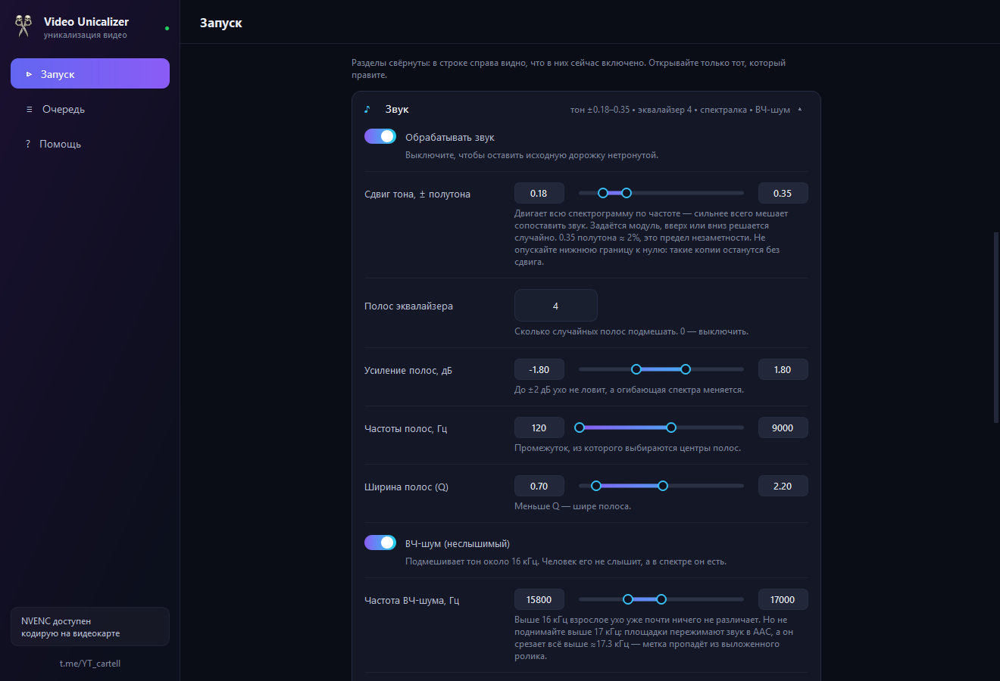
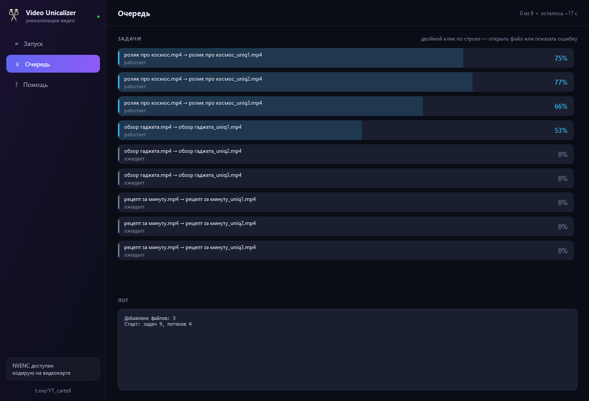
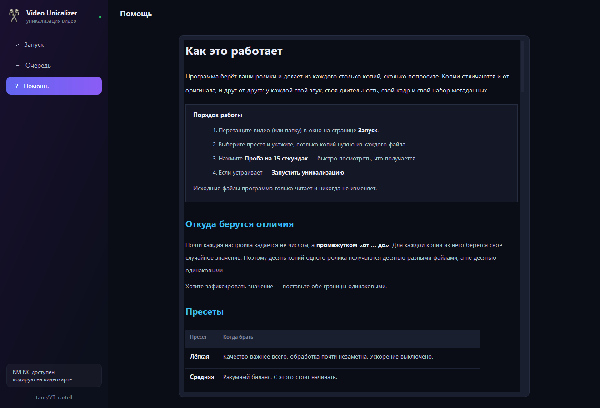

# Video Unicalizer

Пакетная обработка видео: берёт папку роликов и делает из каждого столько копий,
сколько нужно. Копии отличаются и от оригинала, и друг от друга — у каждой свой
звук, длительность, кадр и набор метаданных.

Все эффекты считаются за **один проход ffmpeg** на копию: промежуточные файлы
на диск не пишутся, поэтому работает быстро.



---

## Что меняется в каждой копии

| Область | Что делается |
|---|---|
| Звук | сдвиг высоты тона, случайный эквалайзер, спектральная обработка, микро-эхо, неслышимый ВЧ-тон |
| Наложение | ваша картинка поверх кадра с любой прозрачностью, с медленным дрейфом |
| Скорость | произвольное ускорение (по умолчанию ×2.1–2.2), с сохранением высоты голоса или без |
| Зум | резкий рывок или плавный наезд в заданный момент таймлайна |
| Кадр | микро-кроп, микро-поворот, цвет, оттенок, зерно, виньетка, частота кадров |
| Файл | дата съёмки, марка и модель «камеры», тип контейнера, длина GOP, качество |

---

## Установка

Нужны **Python 3.10+** и **ffmpeg**.

```bash
git clone https://github.com/Karo-Taro/yt-cartel-unicalizer.git
cd yt-cartel-unicalizer
pip install -r requirements.txt
```

**Windows.** ffmpeg удобнее всего положить в папку `bin` рядом с программой
(`ffmpeg.exe` и `ffprobe.exe`) — она ищет его там в первую очередь. Либо
поставить в `PATH`. Сборки: [gyan.dev](https://www.gyan.dev/ffmpeg/builds/),
вариант *essentials*.

**macOS.** `brew install ffmpeg`. Подробности сборки `.app` — в
[`mac/ЧИТАТЬ ПЕРВЫМ (Mac).md`](mac/ЧИТАТЬ%20ПЕРВЫМ%20(Mac).md).

Запуск:

```bash
python app.py
```

На Windows можно двойным кликом по `Запуск.bat`.

---

## Как пользоваться

1. Перетащите видео или папку в окно.
2. Выберите пресет и число копий.
3. **Проба на 15 секундах** — быстро посмотреть, что получается.
4. **Запустить уникализацию**.

Исходные файлы программа только читает и никогда не изменяет.

### Три вещи, которые стоит понять

**Настройки задаются промежутком, а не числом.** Для каждой копии из промежутка
берётся своё случайное значение — поэтому десять копий одного ролика выходят
десятью разными файлами. Нужно зафиксировать значение — поставьте обе границы
одинаковыми.

**Копия воспроизводима.** Рядом с каждым готовым файлом ложится `.json` с сидом
и всеми разыгранными значениями. Понравился вариант — повторите его точь-в-точь:

```bash
python -m unicalizer.cli -i video.mp4 -o out --seed 123456789
```

**Время зумов считается по итоговому ролику**, то есть уже после ускорения. Если
исходник 60 секунд и стоит ×2, итог длится 30 секунд, и зум на 10-й секунде
придётся ровно на середину.



Пока идёт обработка, на странице «Очередь» видно каждую задачу с её прогрессом,
а сверху — сколько осталось. Двойной клик по готовой строке открывает файл,
по упавшей — показывает, что именно сказал ffmpeg, и предлагает повторить.



---

## Консольный режим

```bash
python -m unicalizer.cli -i "C:\video" -o "C:\out" -n 5 --preset hard
```

| Ключ | Что делает |
|---|---|
| `-i` | файлы и/или папки (можно несколько) |
| `-o` | папка для результата |
| `-n` | копий из каждого файла |
| `--preset` | `light`, `medium`, `hard` |
| `--preset-file` | свой пресет `.json`, сохранённый из интерфейса |
| `--overlay`, `--opacity` | картинка для наложения и её непрозрачность |
| `--speed` | фиксированное ускорение, например `2.15` |
| `--jobs` | параллельных задач |
| `--seed` | базовый сид для воспроизводимости |
| `--recursive` | искать видео и во вложенных папках |
| `--dry-run` | показать план, ничего не кодируя |

---

## Производительность

Замеры на RTX 4060 Ti + 16 ядер, ролик 30 секунд 1080×1920, пресет «Средняя».

| Что | Время |
|---|---|
| одна копия | ~4.6 с (в 6.5 раза быстрее реального времени) |
| 8 копий, 1 задача | 35.9 с |
| 8 копий, 2 задачи | 25.1 с |
| 8 копий, 4 задачи | 19.9 с |

Узкое место — **не видеокарта, а фильтры на процессоре**: само кодирование
занимает лишь около десятой части времени. Поэтому разница между NVENC и x264
невелика, а число параллельных задач важнее выбора кодировщика. По умолчанию
берётся четверть от числа ядер, максимум четыре — выше прироста уже нет.

Из этого же следует, на чём удалось выиграть. Микро-поворот кадра раньше делался
фильтром `rotate`, и он один забирал больше половины процессорного времени всей
копии. Тот же поворот через `perspective` даёт визуально ту же картинку
(SSIM 0.995 на типичных 0.5°) и **вдвое дешевле**: 9.4 → 4.6 секунды
процессорного времени на пятнадцатисекундный ролик.

---

## Устройство

```
unicalizer/
    ffmpeg_builder.py  сборка одной команды ffmpeg из параметров — ядро
    engine.py          очередь задач: потоки, прогресс, отмена, отчёты
    params.py          параметры уникализации, пресеты, розыгрыш по сиду
    probe.py           поиск ffmpeg, чтение свойств видео, проверка кодеков
    gui.py             окно на PySide6
    widgets.py         переключатели, двусторонние ползунки, аккордеоны
    ui_schema.py       описание всех полей: подписи, границы, подсказки
    theme.py           палитра и стили
    help_text.py       встроенная инструкция
    config.py          память настроек между запусками
    cli.py             консольный режим
```

Из сторонних библиотек нужны только `PySide6` и `pillow` — всё остальное делает
ffmpeg.

---

## Совместимость

Программа проверяет, какие фильтры умеет ваш ffmpeg, и подстраивается. Например,
сдвиг тона делается через `librubberband`, а если её в сборке нет — через
цепочку из встроенных фильтров: тон получается тот же с точностью до долей
герца.

Обрабатываются любые длительности (проверено от 0.5 с до 2 минут), вертикальные
и горизонтальные ролики, видео без звуковой дорожки, файлы с меткой поворота от
телефона, кириллица и пробелы в путях. Битые файлы пропускаются с пометкой в
логе, а не роняют всю партию.

---

## Полная инструкция

Внутри программы есть вкладка **Помощь** с разбором каждой настройки — что она
делает и в каких пределах остаётся незаметной.



---

## Лицензия

[MIT](LICENSE) — делайте с кодом что хотите.

---

*Сделано для сообщества [t.me/YT_cartell](https://t.me/YT_cartell)*
